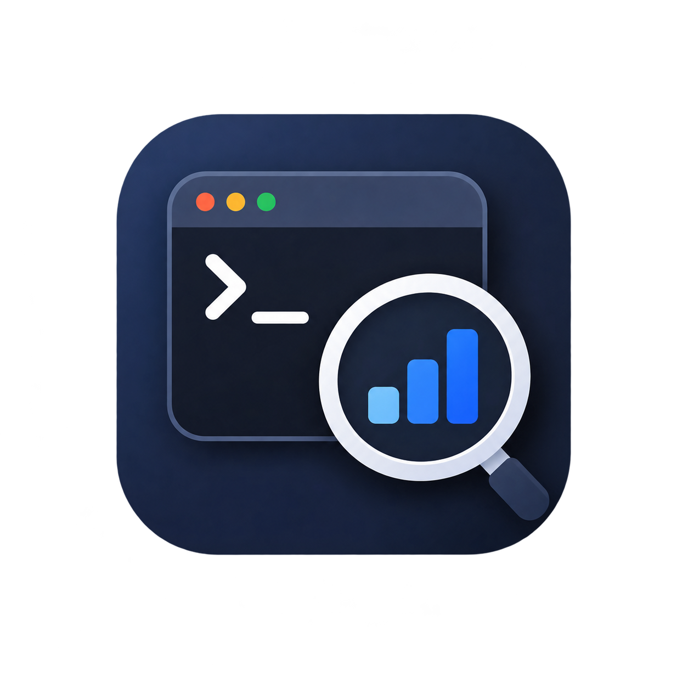

<p align="center">
  
</p>

<h1 align="center">search-cli</h1>

<p align="center">
  A modern, fast CLI & <strong>Model Context Protocol (MCP) Server</strong> for querying the <strong>Google Search Console Search Analytics API</strong>, inspecting index status, and enabling AI assistants (<strong>Codex</strong>, <strong>Claude</strong>, <strong>Cursor</strong>, <strong>Windsurf</strong>, <strong>Antigravity</strong>) to analyze search performance.
</p>

<p align="center">
  <a href="#features">Features</a> •
  <a href="#model-context-protocol-mcp-server">MCP Server</a> •
  <a href="#installation">Installation</a> •
  <a href="#authentication-setup">Authentication</a> •
  <a href="#usage-guide">Usage Guide</a> •
  <a href="PRIVACY_POLICY.md">Privacy Policy</a>
</p>

---


## Features

- 🤖 **Built-in Model Context Protocol (MCP) Server**: Native MCP tooling (`search-cli mcp`) for **Codex**, **Claude Code**, **Claude Desktop**, **Cursor**, **Windsurf**, **Antigravity**, **Goose**, and other AI agents.
- 🔍 **Flexible Search Analytics Queries**: Multi-dimension grouping (`query`, `page`, `country`, `device`, `date`, `searchAppearance`).
- 🎯 **Expressive Filters**: Filter by dimension using intuitive syntax like `query contains "seo"`, `country == usa`, or regex `query regex ^top`.
- 🔐 **Dual Auth Support**:
  - **OAuth 2.0 User Flow**: Web browser login for personal/interactive usage with automatic token refresh.
  - **Service Account**: Headless authentication for automated scripts and CI/CD pipelines.
- 📊 **Multiple Output Formats**: Rich formatted terminal tables, CSV, TSV, and JSON.
- 🌐 **Property & Sitemap Management**: List verified sites, set a default property, check sitemaps status, and inspect URLs.


---

## Installation

### Prerequisites
- Python 3.9+

### Quick Install (Automated)
Clone the repository and run the setup script (automatically creates virtualenv, installs dependencies, and links `search-cli` to `~/.local/bin`):
```bash
git clone https://github.com/obsantos/search-cli.git
cd search-cli
./install.sh
```

### Manual Install
```bash
# 1. Create a virtual environment & install in editable mode
python3 -m venv .venv
source .venv/bin/activate
pip install -e .

# 2. Make search-cli available globally across all terminal tabs
mkdir -p ~/.local/bin
ln -sf $(pwd)/.venv/bin/search-cli ~/.local/bin/search-cli
```
*(Ensure `~/.local/bin` is in your `$PATH`)*.


---

## Authentication Setup

`search-cli` supports two primary authentication modes: **OAuth 2.0 Browser Login** (for interactive/personal use) and **Service Account Keys** (for headless automation, servers, and CI/CD).

### Option 1: OAuth 2.0 Browser Login (Interactive)

`search-cli` uses Google's official **Loopback IP Redirect Flow**. When you run the login command, your browser opens automatically, and once you approve access, Google sends the token directly back to your CLI on localhost (no manual code copying needed).

#### 1. Setup Google Cloud Project:
1. Open the [Google Cloud Console](https://console.cloud.google.com/) and select or create a project.
2. **Enable the Google Search Console API:**  
   Navigate to the [Google Search Console API Library](https://console.cloud.google.com/apis/library/searchconsole.googleapis.com) and click **"ENABLE"**.  
   *(⚠️ Required: If not enabled, Google will return a 403 `accessNotConfigured` error).*
3. **Configure OAuth Consent Screen:**  
   Under **Google Auth Platform ➔ Audience**, set User type to **External** and publishing status to **In production** (allows up to 100 users without full review).
4. **Create Credentials:**  
   Under **Clients / Credentials**, click **Create Credentials ➔ OAuth client ID** and select Application type: **Desktop App**.


#### Login Methods:

* **Method A: Using downloaded `client_secrets.json` (Recommended)**
  ```bash
  search-cli auth login --credentials /path/to/client_secrets.json
  ```
  *(Or place the file at `~/.config/search-cli/client_secrets.json` and just run `search-cli auth login`).*

* **Method B: Using Client ID & Client Secret strings**
  ```bash
  search-cli auth login \
    --client-id "YOUR_CLIENT_ID.apps.googleusercontent.com" \
    --client-secret "YOUR_CLIENT_SECRET"
  ```

* **Method C: Using Environment Variables**
  ```bash
  export SEARCH_CLI_CLIENT_ID="YOUR_CLIENT_ID.apps.googleusercontent.com"
  export SEARCH_CLI_CLIENT_SECRET="YOUR_CLIENT_SECRET"
  search-cli auth login
  ```

> [!NOTE]
> **One-Time Consent Screen:** Because Search Console is a sensitive scope, when logging into an unverified app for the first time, Google will display *"Google hasn't verified this app"*. Simply click **Advanced ➔ Go to Search CLI (unsafe)**. Tokens are saved locally to `~/.config/search-cli/token.json` and refresh automatically.


---

### Option 2: Service Account Key (Headless / AI Agent Automation)

For automated pipelines, background jobs, or AI tool callers where no browser interaction is possible:

1. In Google Cloud Console, ensure the **[Google Search Console API](https://console.cloud.google.com/apis/library/searchconsole.googleapis.com)** is enabled on your project.
2. Go to **IAM & Admin ➔ Service Accounts** and create a service account.
3. Generate and download a **JSON key**.
4. In [Google Search Console](https://search.google.com/search-console) ➔ **Settings ➔ Users and permissions**, add your service account email (e.g. `service-account@project.iam.gserviceaccount.com`) with **Full** or **Restricted** permissions.
5. Configure `search-cli`:
   ```bash
   search-cli auth service-account --key /path/to/service_account.json
   ```
   *(Alternatively, set `GOOGLE_APPLICATION_CREDENTIALS=/path/to/service_account.json`).*


---

## Usage Guide

### 1. View Auth Status
```bash
search-cli auth status
```

### 2. List Verified Properties
```bash
search-cli sites list
```

### 3. Set a Default Site
Avoid typing `--site` on every command:
```bash
search-cli sites default "sc-domain:example.com"
# or
search-cli sites default "https://example.com"
```

### 4. Query Search Analytics

#### Top Queries in the Last 28 Days
```bash
search-cli query --limit 20
```

#### Top Pages
```bash
search-cli query --dimension page --limit 20
```

#### Multi-Dimension Queries (Queries + Pages)
```bash
search-cli query --dimension query,page --limit 50
```

#### Date Ranges
```bash
# Last 7 days
search-cli query --days 7

# Custom date range
search-cli query --start-date 2026-01-01 --end-date 2026-01-31
```

#### Filtering
Filter syntax supports `contains`, `!contains`, `==`, `!=`, and `regex`:
```bash
# Query contains keyword
search-cli query --filter "query contains pricing"

# Query starts with "how to" using regex
search-cli query --filter "query regex ^how to"

# Exclude specific URL paths and filter by country
search-cli query \
  --dimension query,country \
  --filter "page !contains /tags/" \
  --filter "country == usa"
```

#### Search Types & Fresh Data
```bash
# Image search queries
search-cli query --search-type image

# Include fresh provisional data
search-cli query --data-state all
```

#### Sorting & Pagination
```bash
# Sort by CTR ascending or descending
search-cli query --sort-by ctr --asc
search-cli query --sort-by impressions --limit 50 --offset 50
```

#### Exporting (CSV / JSON / TSV)
```bash
# Export to CSV file
search-cli query --dimension query,page --format csv --output report.csv

# Output JSON for piping into jq
search-cli query --format json | jq '.rows[:5]'
```

### 5. Inspect a URL
Check index coverage, canonicalization, and crawl state:
```bash
search-cli inspect "https://example.com/blog/my-post"
```

### 6. View Sitemaps
```bash
search-cli sitemaps list
```

---

## Model Context Protocol (MCP) Server

`search-cli` includes a built-in **MCP Server** using the official Model Context Protocol standard (`mcp>=2.0.0`), allowing AI assistants (**Codex**, **Claude Code**, **Claude Desktop**, **Cursor**, **Windsurf**, **Antigravity**, **Goose**, **VS Code**) to natively query your Google Search Console data.

### 1. Exposed MCP Tools
* `query_search_analytics`: Query clicks, impressions, CTR, average position with dimension breakdown, filters, date ranges, and sorting.
* `list_properties`: List all verified Google Search Console properties and permission levels.
* `inspect_url`: Inspect index coverage state, verdict, robots.txt, and canonical URLs.
* `list_sitemaps`: List submitted sitemaps, last download timestamps, and error/warning counts.
* `get_authentication_status`: Check current authentication status and account details.

---

### 2. Quick Add via CLI Commands

If your AI assistant has a CLI, you can add `search-cli` in a single command:

#### 🤖 Codex CLI
```bash
codex mcp add search-console -- search-cli mcp
```

#### 🟣 Claude Code CLI
```bash
# Add to current project:
claude mcp add search-console -- search-cli mcp

# Or add globally across all projects:
claude mcp add search-console --scope user -- search-cli mcp
```

#### 🦢 Goose CLI
```bash
goose mcp add search-console search-cli mcp
```

#### 🐙 GitHub Copilot CLI
In the interactive CLI prompt:
```text
/mcp add search-console search-cli mcp
```

> [!TIP]
> **Virtual Environment Executable Path & Lifecycle:**  
> If `search-cli` is installed in a local virtual environment rather than globally, use the full path to the executable (e.g., `/path/to/search-cli/.venv/bin/search-cli`):
> ```bash
> claude mcp add search-console --scope user -- /path/to/search-cli/.venv/bin/search-cli mcp
> ```
> **No background daemon needed:** You do **not** need to manually start or keep the server running. Your AI client automatically starts and terminates `search-cli mcp` in the background for each session over `stdio`.

---


### 3. Add via Configuration Files

#### Standard MCP Format (Claude Desktop, Cursor, Windsurf, Antigravity, VS Code, Zed)
Paste into your client's configuration file:
* **Claude Desktop:** `~/Library/Application Support/Claude/claude_desktop_config.json` (macOS) / `%APPDATA%\Claude\claude_desktop_config.json` (Windows)
* **Cursor:** `.cursor/mcp.json` (or *Settings ➔ Features ➔ MCP*)
* **Windsurf:** `~/.codeium/windsurf/mcp_config.json`
* **Antigravity / VS Code:** `.vscode/settings.json` or user `settings.json`

```json
{
  "mcpServers": {
    "search-console": {
      "command": "search-cli",
      "args": ["mcp"]
    }
  }
}
```

#### 🤖 Codex (`~/.codex/config.json` or `.codex/config.json`)
```json
{
  "mcp": {
    "servers": {
      "search-console": {
        "command": "search-cli",
        "args": ["mcp"]
      }
    }
  }
}
```


---

### 4. Run Standalone Server
```bash
# Standard I/O mode (default for IDEs and CLI agents):
search-cli mcp
# or
search-cli --mcp

# Network SSE mode (for remote HTTP agents):
search-cli mcp --transport sse --host 127.0.0.1 --port 8000
```


---

## Configuration

You can view and set configuration defaults at any time:
```bash
# View configuration
search-cli config list

# Set default site property
search-cli config set default_site "sc-domain:example.com"

# Clear credentials
search-cli auth logout
```


---

## Development & Testing

Run tests with pytest:
```bash
pytest
```

---

## Privacy & Legal

`search-cli` runs entirely on your local machine. All Google Search Console analytics data and OAuth tokens are stored locally and are never transmitted to any third-party server.

* [Privacy Policy](PRIVACY_POLICY.md)
* [Terms of Service](TERMS_OF_SERVICE.md)
* [MIT License](LICENSE)


